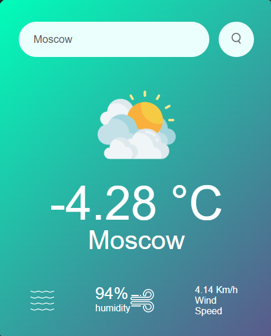
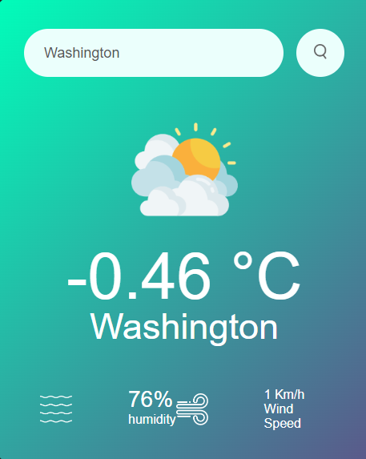

# Weather Report App

The Weather Report App is a simple web application that allows users to check the current weather for a specific city. The app fetches weather data from the OpenWeatherMap API and displays relevant information such as temperature, humidity, wind speed, and a weather icon.







## Features

- **Weather Information:** Displays real-time temperature, humidity, wind speed, and a weather icon based on the current conditions.
- **Error Handling:** Provides an error message if the specified city is not found.

## Prerequisites

Before using the application, you need to obtain an API key from OpenWeatherMap. Here's how:

1. Visit [OpenWeatherMap](https://openweathermap.org/) and sign up for a free account.
2. Once logged in, navigate to the API keys section to obtain your unique API key.

## Installation

1. Clone the repository to your local machine:

   ```bash
   git clone https://github.com/your-username/weather-report-app.git

2. cd weather-report-app

3. const apiKey = "YOUR_API_KEY";

4. Open the index.html file in a web browser or set up a local server.

   Usage
1. Open the application in a web browser.
2. Enter the name of the city you want to check in the search input.
3. Click the "Search" button.
4. The weather information for the specified city will be displayed, or an error message will appear if the city is not found.
5. The application uses different weather icons based on the current weather conditions:
   . Cloudy :
     
   . Clear:
   
   . Drizzle:
   
   . Rain
   
   . Mist
   
The weather icon will change based on the weather conditions of the specified city.

This project is licensed under the Common License.


   


 
  

